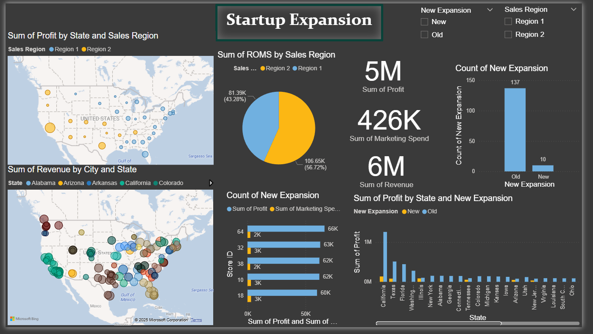

# 📈 Startup Expansion Analytics Dashboard

An end-to-end Data Analytics project that demonstrates the complete analytics workflow using **Python** and **Power BI**. The project focuses on cleaning, exploring, and visualizing startup expansion data to uncover business insights and support strategic decision-making.

---

## 📌 Project Overview

This project analyzes startup expansion data to evaluate business performance across different states and sales regions.

The workflow begins with data cleaning and preprocessing in **Python**, followed by exploratory data analysis (EDA), and concludes with an interactive **Power BI dashboard** for business reporting.

---

## 🛠 Technologies Used

- Python
- Pandas
- Jupyter Notebook
- Power BI
- Power Query

---

## 📂 Dataset

The dataset contains information about startup expansion, including:

- Revenue
- Profit
- Marketing Spend
- Sales Region
- State
- City
- New Expansion Status

---

## ⚙️ Project Workflow

### 1. Data Preparation

- Imported the dataset into Jupyter Notebook.
- Cleaned missing and inconsistent values.
- Prepared the dataset for analysis.
- Exported the processed data for visualization.

---

### 2. Exploratory Data Analysis (EDA)

Performed data exploration using Python to understand:

- Revenue distribution
- Profit trends
- Marketing spend
- Regional performance
- Startup expansion patterns

Created multiple visualizations to identify business insights before building the dashboard.

---

### 3. Power BI Dashboard

Built an interactive dashboard featuring:

- KPI Cards
- Revenue Analysis
- Profit Analysis
- Marketing Spend Analysis
- Sales Region Comparison
- State Performance
- Interactive Maps
- Dynamic Filters (Slicers)

---

## 📊 Dashboard Features

✔ Total Revenue

✔ Total Profit

✔ Marketing Spend

✔ Sales Region Analysis

✔ State Performance

✔ Expansion Analysis

✔ Interactive Maps

✔ KPI Cards

✔ Slicers

✔ Interactive Visualizations

---

## 📷 Dashboard Preview



---

## 📈 Key Insights

- Compared startup performance across sales regions.
- Identified high-performing states based on revenue and profit.
- Evaluated marketing spend versus generated profit.
- Analyzed expansion status across different locations.
- Delivered interactive reports for business decision-making.

---

## 🚀 Skills Demonstrated

- Data Cleaning
- Data Preprocessing
- Exploratory Data Analysis (EDA)
- Data Visualization
- Business Intelligence
- Power BI Dashboard Development
- KPI Reporting
- Interactive Dashboard Design
- Business Analytics

---

## 📁 Repository Structure

```
Startup-Expansion-Analytics
│
├── README.md
├── data
│   └── startupsexpansionmodified.csv
│
├── notebooks
│   └── Data_Cleaning_EDA.ipynb
│
├── powerbi
│   └── overview.pbix
│
└── images
    └── dashboard.png
```

---

## 👤 Author

**Mohamed Gamal**

- GitHub: https://github.com/mo7amedgamal2
- LinkedIn: https://www.linkedin.com/in/mohamed-gamal-eldeen/
